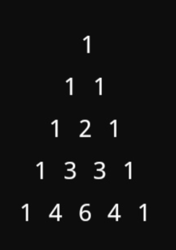
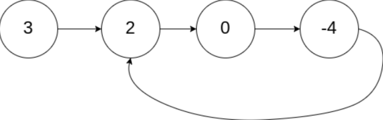
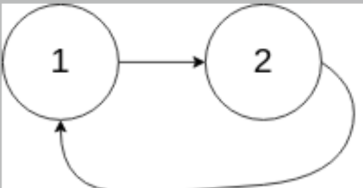
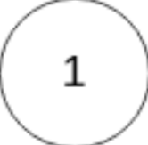

# Easy Level Problems

## Q1. Pascal's Triangle

**Problem Statement:**  
Generate the first `n` rows of Pascal's Triangle.  
Given an integer `n`, return the first `n` rows of Pascal's Triangle.

**Input:**  
5
**Expected Output:**  
The first 5 rows of Pascal's Triangle:
**[ [1], [1, 1], [1, 2, 1], [1, 3, 3, 1], [1, 4, 6, 4, 1] ]**

---

---

## Q2. Climbing Stairs

**Problem Statement:**  
You are climbing a staircase. It takes `n` steps to reach the top. Each time you can either climb 1 step or 2 steps. In how many distinct ways can you climb to the top?

**Input:**  
n = 2

**Output:**  
2

**Explanation:**  
There are two ways to climb to the top:
1. 1 step + 1 step
2. 2 steps

---
# Medium

## Q3. Find First and Last Position of Element in Sorted Array

Given an array of integers `nums` sorted in non-decreasing order, find the starting and ending position of a given `target` value. If the `target` is not found in the array, return `[-1, -1]`. You must write an algorithm with `O(log n)` runtime complexity.

### Examples:

**Example 1:**
- Input: nums = [5,7,7,8,8,10], target = 8
- Output: [3,4]

**Example 2:**
- Input: nums = [5,7,7,8,8,10], target = 6
- Output: [-1,-1]

**Example 3:**
- Input: nums = [], target = 0
- Output: [-1,-1]

---

## Q4. String Compression

Given an array of characters `chars`, compress it using the following algorithm: Begin with an empty string `s`. For each group of consecutive repeating characters in `chars`:
- If the group's length is 1, append the character to `s`.
- Otherwise, append the character followed by the group's length.

The compressed string `s` should not be returned separately, but instead, be stored in the input character array `chars`. Note that group lengths that are `10` or longer will be split into multiple characters in `chars`. After you are done modifying the input array, return the new length of the array. You must write an algorithm that uses only constant extra space.

### Examples:

**Example 1:**
- Input: chars = ["a","a","b","b","c","c","c"]
- Output: Return `6`, and the first `6` characters of the input array should be: `["a","2","b","2","c","3"]`
- Explanation: The groups are "aa", "bb", and "ccc". This compresses to "a2b2c3".

**Example 2:**
- Input: chars = ["a"]
- Output: Return `1`, and the first character of the input array should be: `["a"]`
- Explanation: The only group is "a", which remains uncompressed since it's a single character.

**Example 3:**
- Input: chars = ["a","b","b","b","b","b","b","b","b","b","b","b","b"]
- Output: Return `4`, and the first `4` characters of the input array should be: `["a","b","1","2"]`
- Explanation: The groups are "a" and "bbbbbbbbbbbb". This compresses to "ab12".

---
# Hard

## Q5. Find the Start of Cycle in a Linked List

Given the `head` of a linked list, return the node where the cycle begins. If there is no cycle, return `null`. There is a cycle in a linked list if there is some node in the list that can be reached again by continuously following the `next` pointer. Internally, `pos` is used to denote the index of the node that the tail's `next` pointer is connected to (0-indexed). It is `-1` if there is no cycle. **Note that `pos` is not passed as a parameter.**

**Do not modify the linked list.**

### Examples:

**Example 1:**-

- Input: head = [3,2,0,-4], pos = 1
- Output: tail connects to node index 1
- Explanation: There is a cycle in the linked list, where the tail connects to the second node.

**Example 2:**-

- Input: head = [1,2], pos = 0
- Output: tail connects to node index 0
- Explanation: There is a cycle in the linked list, where the tail connects to the first node.

**Example 3:**-

- Input: head = [1], pos = -1
- Output: no cycle
- Explanation: There is no cycle in the linked list.
